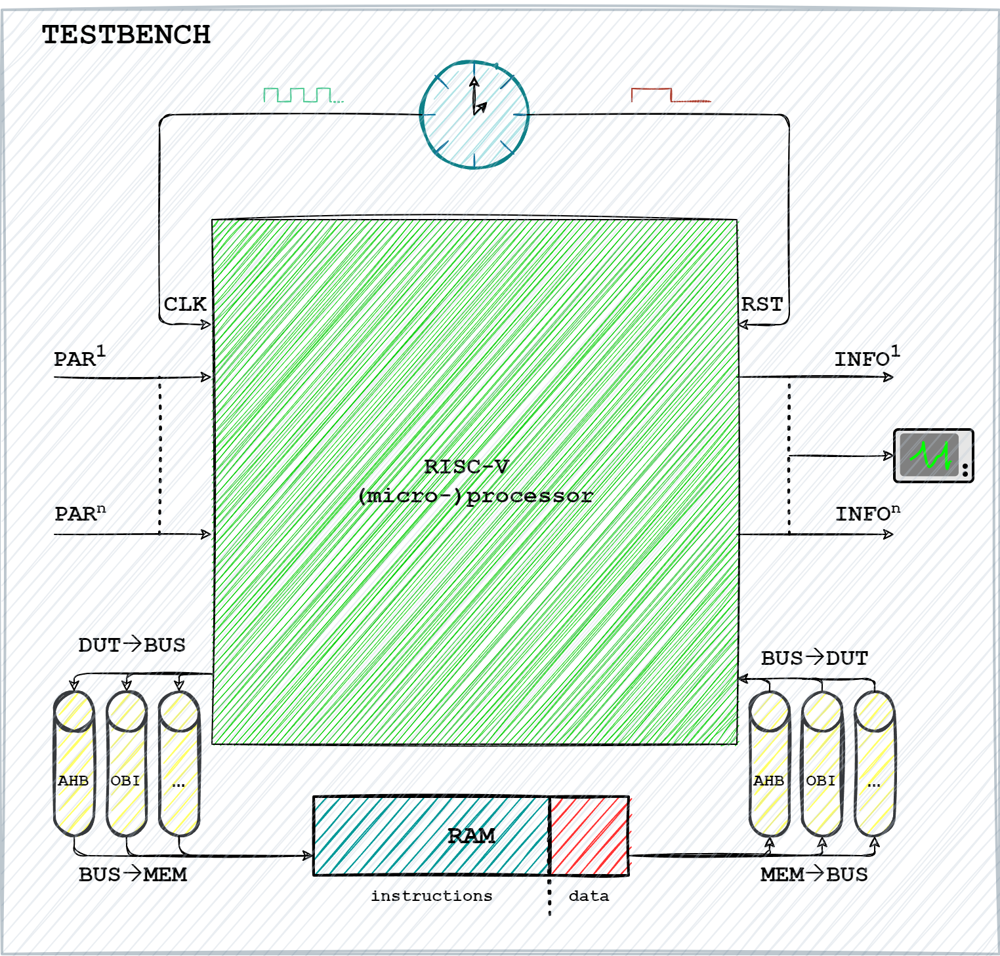
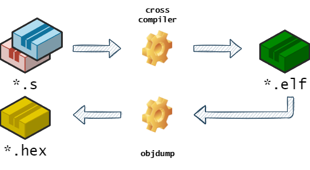

# R4VES: **R**ISC-**V** **E**nvironment **4** **S**imulations

R4VES is a modular environment based on commercial EDA tools for fault and logic simulation of RISC-V cores. The tools are:

- [Siemens QuestaSim: Questa Advanced Simulator](https://eda.sw.siemens.com/en-US/ic/questa/simulation/advanced-simulator/) for logic simulation
- [Synopsys Z01X: Z01X Functional Safety Assurance](https://www.synopsys.com/verification/simulation/z01x-functional-safety.html) for fault simulation

This simulation environment has been created to generalize test bench code. Many RTL designs typically are acompanied by their respective test benches which are very specific and in certain cases solid knowledge about the architecture specifics must be known to the test engineer in order to perform even a simple logic simulation. The goal of this environment is to abstract from the specifics of the architecture to ease the execution of logic and fault simulations and obtain resulting data from it (e.g., a value change dump (`.vcd`) file, or a test report (`.rpt`)). For fault simulation using the `Z01X` simulator a strobe file (`strobe.sv`) is provided that evaluates the SBST result at the end of the simulation.

## Directory structure

- configurations: Configuration files to compile the SBST and do fault / logic simulations for processors
- sources: Test bench and source files for processor cores
  - gate_level: Gate level source files for the processor cores (synthesized for a technology library)
  - sbst: SBST programs in assembly for the processor cores
  - tech_libs: NanGate technology library etc. for synthesis
  - testbench: The main test bench (described below) that is used to simulate the processor cores
  - wave_config: Configurations for the wave window for ModelSim / QuestaSim for the processor cores
  - zoix: Z01X Configuration files and templates for logic and fault simulation
- execute.py: The main R4VES run script that parses the simulation configuration and launches the required tools
- Makefile: Runs the execute.py script for predefined processor configurations (for lazy people that don't want to type long commands - like me)

## Using the tool

The tool has only a few configuration options:

- `--config`: Specifies the configuration that contains source and task configurations (located in the `configurations` directory).
- `--tools`: Specified the configuration that contains tool definitions (located in the `tools` directory).
- `--force`: Force overwriting generated files.
- `--tasks`: Specifies the task(s) that are executed.

To list all available tasks leave out the tasks option (configuration file is required).

## Configuration files

The FSIM environment is configured via a JSON configuration file. This file is used to automatically adjust all necessary parts to the processor core at hand.

The configuration file is split into two main sections. As shown below one section is the `sources` section that defines the source files, environment variables, parameters, plusargs, commands and defines that are passed during compilation and execution. Every configuration option except `sources` can be left out if not required. The define, parameter, plusargs and environment settings can alternatively or additionally be indirectly specified via the `_file` options which contain `=`-separated key and value pairs.

- environment: Environment variables for the tools which can also be accessed via `::env(NAME)` in TCL source files
- defines: Preprocessor macro definitions which can be accessed via `#ifdef` or `` `ifdef `` in C / Verilog / VHDL source files
- plusargs: Additional arguments which can be accessed via `$value$plusargs("NAME=%d", TARGET)` in Verilog / VHDL source files
- parameters: Instantiation parameters (param, localparam) which are used for the top level module in Verilog / VHDL source files
- commands: Additional command line parameters that are passed to the tools in ModelSim tasks

The second section is the `task` section. It contains the tasks that can be run via this tool. Each tasks is allowed to have defines, parameters, plusargs and environment settings exactly like in the sources section.
A `configuration` section specifies

```jsonc
{
  "name": "my-processor",
  "sources": {
    "rtl": {
      "defines": {
        "MY_CONFIG": "42"
      },
      "defines_file": "my-processor.defines",
      "plusargs": [
        { "name": "my_config", "type": "value", "value": "42" },
        { "name": "my_file", "type": "file", "file": "my-processor.data" }
      ],
      "plusargs_file": "my-processor.plusargs",
      "parameters": {
        "processor.my_config": "32'h 42"
      },
      "parameters_file": "my-processor.parameters",
      "environment": [
        { "name": "MY_CONFIG", "type": "value", "value": "42" }
        { "name": "MY_FILE", "type": "file", "value": "my-processor.data" }
      ],
      "environment_file": "my-processor.environment",
      "sources": [
        { "type": "verilog", "file": "rtl-core.v" },
        { "type": "system-verilog", "file": "rtl-memory.sv" },
        { "type": "vhdl", "file": "rtl-bus.vhd" }
      ]
    },
    "testbench": {
      // More source definitions ...
    },
    "sbst-program": {
      "sources": [
        { "type": "assembly", "file": "sbst.asm" },
        { "type": "linker", "file": "sbst.ld" }
      ],
    },
    // More implementation sources here ...
  },
  "tasks": {
    "compile-sbst": {
      "description": "Cross-compiles the SBST program for RISC-V",
      "target": "gcc-compile",
      "sources": [ "sbst-program" ],
      "configuration": {
        // Task specific options here
      },
      "defines": { },
      "defines_file": "",
      "plusargs": [ ],
      "plusargs_file": "",
      "parameters": { },
      "parameters_file": "",
      "environment": [ ],
      "environment_file": ""
    },
    "logic-simulation-rtl-gui": {
      "description": "Run the logic simulation (RTL-level)",
      "target": "modelsim-logic-simulation",
      "sources": [ "rtl", "testbench" ],
      "configuration": {
        // Task specific options here
      },
      "defines": { },
      "defines_file": "",
      "plusargs": [ ],
      "plusargs_file": "",
      "parameters": { },
      "parameters_file": "",
      "environment": [ ],
      "environment_file": "",
      "commands": [
        // Or often called DO-file (my-processor.do)
        { "type": "file", "path": "my-processor.tcl" },
        { "type": "command", "command": "run -all" }
      ]
    },
    // More task definitions here ...
  }
}
```

## Targets and Target Parameters

Each configuration task specifies a target which contains steps that are run consecutively.
Each target and its parameters are listed in the following:

- Target **gcc-compile**: Compiles source code with GCC
  - Parameter machine-architecture: The RISC-V machine architecture -march flag (values: rv32e, rv32i, rv64e, rv64i)
  - Parameter machine-abi: The RISC-V ABI -mabi flag (values: ilp32e, lp32, lp32f, lp64, lp64f, lp64d)
  - Parameter elf-file: Output file for the generated program
  - Parameter hex-file: Output file for the generated memory image
  - Parameter map-file: Output file for the generated listing of the program
  - Parameter addresses-file: Output file that contains the addresses (hex) of _start and _sbst* labels
- Target **modelsim-logic-simulation**: Runs a logic simulation with ModelSim / QuestaSim
  - Parameter optimize-testbench: Enable optimization of the testbench via the vopt command (requires QuestaSim)
- Target **zoix-logic-simulation**: Runs a logic simulation with Z01X
  - Parameter faults_file: A Z01X fault definition file (SFF)
  - Parameter strobe_file: A Z01X strobe file that will be used for untestability analysis on fault list creation
  - Parameter init_script: A script to initialize the testbench (used for loading memories)
  - Parameter memory_file: A HEX memory image that is used to initialize the memory by the init script
- Target **zoix-fault-simulation**: Runs a fault simulation with Z01X
  - Parameter faults_file: A Z01X fault definition file (SFF)
  - Parameter strobe_file: A Z01X strobe file that will be used for untestability analysis on fault list creation
  - Parameter init_script: A script to initialize the testbench (used for loading memories)
  - Parameter memory_file: A HEX memory image that is used to initialize the memory by the init script
  - Parameter fsim_script: A fault simulation script to run the fault injection campaign
  - Parameter coverage_file: Output file for the generated fault coverage
  - Parameter summary_file: Output file for the generated fault summary

## Test Bench



The test bench is configurable in the form of `defines` (in compilation time) and `plusargs` (in run-time).
Define names are using capital case while plusarg names are all in lower case.
Often a define is used to enable a feature and additional plusarg are used to configure it.
These configuration options are:

| Argument                           | Required | Depends on                                                                                       |  Description                                                                        |
|:---------------------------------- |:-------- |:------------------------------------------------------------------------------------------------ |:----------------------------------------------------------------------------------- |
| `TESTBENCH_CLOCK_PERIOD_NS`        | Yes      |                                                                                                  | Period of the CLK signal in **nanoseconds**.                                        |
| `TESTBENCH_RESET_CYCLES`           | Yes      |                                                                                                  | Number of clock cycles for the RST signal to be active.                             |
| `TESTBENCH_EXIT_ON_EXCEPTION`      | No       |                                                                                                  | Exits the test bench if the processor signals an exception / trap.                  |
| `TESTBENCH_SBST_OBSERVE`           | No       | `sbst_program_start`, `sbst_program_end`                                                         | Prints the time when the SBST reaches the start and end markers.                    |
| `TESTBENCH_VCD_DUMP`               | No       | `dump_vcd`                                                                                       | Enables dumping the testbench trace as VCD.                                         |
| `TESTBENCH_PROBES_DUMP`            | No       | `dump_signals`                                                                                   | Enables dumping signals that are selected by the signal list.                       |
| `TESTBENCH_PROBES_DUMP_TRIGGER`    | No       | `TESTBENCH_PROBES_DUMP`, `dump_at`, `dump_trigger_console`, `dump_trigger_file`                  | Dumps the specified signal list when the specific time point is reached.            |
| `TESTBENCH_PROBES_DUMP_SBST_START` | No       | `TESTBENCH_PROBES_DUMP`, `sbst_program_start`, `dump_sbst_start_console`, `dump_sbst_start_file` | Dumps the specified signal list when the start of the SBST is reached.              |
| `TESTBENCH_PROBES_DUMP_SBST_END`   | No       | `TESTBENCH_PROBES_DUMP`, `sbst_program_end`, `dump_sbst_end_console`, `dump_sbst_end_file`       | Dumps the specified signal list when the end of the SBST is reached.                |
| `TESTBENCH_TIMEOUT`                | No       | `timeout`                                                                                        | Exits the test bench if the specified number of clock cycles has been reached.      |
| `TESTBENCH_SBST_AUTO_EXIT`         | No       | `sbst_program_end`                                                                               | Exits the test bench if the end of the SBST program has been reached.               |
| `TESTBENCH_TARGET_PICORV32`        | No       |                                                                                                  | Enables the PicoRV32 processor in the test bench.                                   |
| `TESTBENCH_TARGET_DARKRISCV`       | No       |                                                                                                  | Enables the DarkRISCV processor in the test bench.                                  |
| `TESTBENCH_TARGET_CV32E4OP`        | No       |                                                                                                  | Enables the CV32E40P processor in the test bench.                                   |
| `log_debug`                        | No       |                                                                                                  | Enables debug level output to the console during simulation.                        |
| `timeout`                          | No       |                                                                                                  | Timeout of the test bench in **nanoseconds**.                                       |
| `dump_vcd`                         | No       |                                                                                                  | Output filename for the VCD file.                                                   |
| `dump_signals`                     | No       |                                                                                                  | Input filename of signals to dump.                                                  |
| `dump_at`                          | No       |                                                                                                  | Time in **nanoseconds** when to dump the signals.                                   |
| `dump_trigger_console`             | No       |                                                                                                  | Enable (1) or disable (0) dump of the signals to the console.                       |
| `dump_trigger_file`                | No       |                                                                                                  | Output filename to dump the signals to. Leave empty to disable.                     |
| `dump_sbst_start_console`          | No       |                                                                                                  | Enable (1) or disable (0) dump of the signals to the console.                       |
| `dump_sbst_start_file`             | No       |                                                                                                  | Output filename to dump the signals to. Leave empty to disable.                     |
| `dump_sbst_end_console`            | No       |                                                                                                  | Enable (1) or disable (0) dump of the signals to the console.                       |
| `dump_sbst_end_file`               | No       |                                                                                                  | Output filename to dump the signals to. Leave empty to disable.                     |
| `sbst_program_start`               | No       |                                                                                                  | Start address of the SBST program in bytes (HEX).                                   |
| `sbst_program_end`                 | No       |                                                                                                  | End address of the SBST program in bytes (HEX).                                     |
| ---------------------------------- | -------- | ------------------------------------------------------------------------------------------------ | ----------------------------------------------------------------------------------- |
| `MEMORY_ADDRESS_BITS`              | Yes      |                                                                                                  | Specifies the number of bytes of the memory (in 2^MEMORY_ADDRESS_BITS).             |
| `MEMORY_DUAL_PORT`                 | No       |                                                                                                  | Enables the memory dual port access of the memory.                                  |
| `MEMORY_ENABLE_DEBUG`              | No       | `memory_debug`                                                                                   | Enable debugging facility of memory transactions.                                   |
| `MEMORY_ENABLE_LOAD`               | No       | `memory_image`                                                                                   | Enables loading a memory image on test bench start.                                 |
| `memory_debug`                     | No       | `log_debug`                                                                                      | Print the memory transactions to the console.                                       |
| `memory_image`                     | No       |                                                                                                  | The memory image file (HEX) to initialize the memory with on test bench startup.    |
| ---------------------------------- | -------- | --------------------------------------------------------------------------------------------     | ----------------------------------------------------------------------------------- |
| `STROBE_SBST_OBSERVE`              | No       | `sbst_program_start`, `sbst_program_end`                                                         | Prints the time when the SBST reaches the start and end markers.                    |
| `STROBE_TIMEOUT`                   | No       | `timeout`                                                                                        | Terminates the simulation if the specified number of clock cycles has been reached. |
| `STROBE_SBST_TYPE1`                | No       | `sbst_program_end`, `sbst_end_timeout`                                                           | Enables fault evaluation for SBST type 1.                                           |
| `STROBE_TARGET_PICORV32`           | No       |                                                                                                  | Enables the SBST evaluation for the PicoRV32 processor.                             |
| `STROBE_TARGET_DARKRISCV`          | No       |                                                                                                  | Enables the SBST evaluation for the DarkRISCV processor.                            |
| `STROBE_TARGET_CV32E4OP`           | No       |                                                                                                  | Enables the SBST evaluation for the CV32E40P processor.                             |

## Firmware compilation



Running a logic simulation of any of the RISC-V cores requries an SBST firmware memory image in the form of a `.hex` file.
The firmware is loaded into the memory via the `$readmemh` command before the simulation starts.

The compilation process consists of:

1. Compiling sources `.asm` to intermediate object `.o` files via the compiler.
2. Linking the object files via the linker script `.ld` into a RISC-V executable `.elf` file using the linker.
3. Conversion of the executable to a memory image `.hex` file with the help of the objdump tool.
4. Creation of an address listing `.addresses` file via the objdump tool.

## Citations
You can reference the R4VES framework by using the following `@misc` entry in Bibtex
```
@misc{misc:r4ves,
    author       = "{CAD Group, Politecnico di Torino \& University of Freiburg}",
    title        = "{R4VES: RISC-V Environment For Simulations}",
    howpublished = "\url{https://github.com/cad-polito-it/r4ves}",
    year         = "2023"
}
```

## Contact Information
- [Nick Deligiannis](mailto:nikolaos.deligiannis@polito.it)
- [Tobias Faller](mailto:fallert@tf.uni-freiburg.de)


